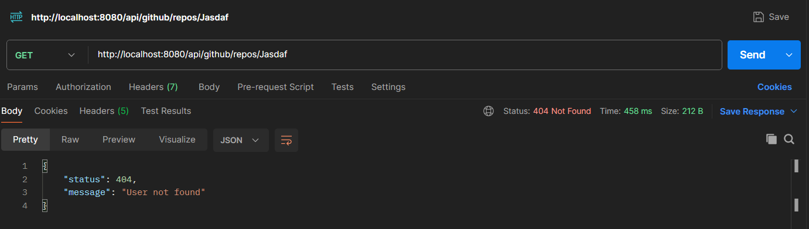
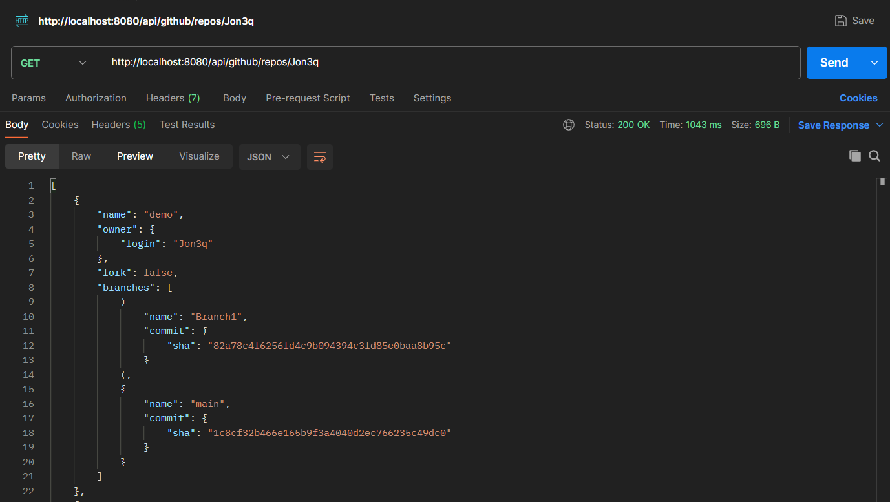

GETREPOS project was crated to acquire data from github users via api.

Table of Contents:
- [Technologies](#technologies)
- [Features](#features)
- [Usage](#usage)
- [Headers](#headers)

## Technologies

- Java 21
- Maven 
- Spring Boot 3.3.2
  - Dependencies:
    - Lombok
    - Spring Web
    - Spring DevTools

## Features

After sending get request you may receive one of two responses.

The first one is when then requested user does not exist on GitHub - the custom error message is printed as a response.

The second is whenever the user exists and in this case has open repositories, which are not forks.

The endpoint for both requests: /repos/{username}

## Headers

In this api it was necessary to use proper GitHub API headers to read specific type of data from requests.

Here we used Header "Accept" which validates if the response from request is type json.

As an inputs for method used with the header we put the username and acceptable type of file we want to acquire from request.

